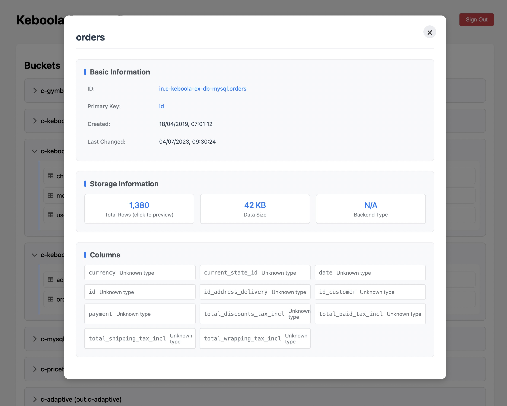

# Keboola Storage Browser

A simple web application that allows you to browse your Keboola Storage buckets and tables using the Keboola Storage API.

## Features

- Login with Keboola Storage API token
- Browse all available buckets
- View tables within each bucket
- Clean and modern user interface

## Screenshot



## Prerequisites

- Python 3.7+
- pip (Python package manager)

## Setup

1. Clone this repository
2. Create a virtual environment:
   ```bash
   python3 -m venv venv
   ```
3. Activate the virtual environment:
   - On macOS/Linux:
     ```bash
     source venv/bin/activate
     ```
   - On Windows:
     ```bash
     venv\Scripts\activate
     ```
4. Install the required dependencies:
   ```bash
   python -m pip install -r requirements.txt
   ```

## Running the Application

1. Make sure your virtual environment is activated (you should see `(venv)` in your terminal prompt)
2. Start the Flask server:
   ```bash
   python app.py
   ```
3. Open your web browser and navigate to `http://localhost:5000`
4. Enter your Keboola Storage API token and endpoint (e.g., connection.keboola.com)
5. Click "Connect" to start browsing your storage

## Security Notes

- The application stores your API token in the server session
- All communication with the Keboola API is done through HTTPS
- Never share your API token with others
- For production use, additional security measures should be implemented 